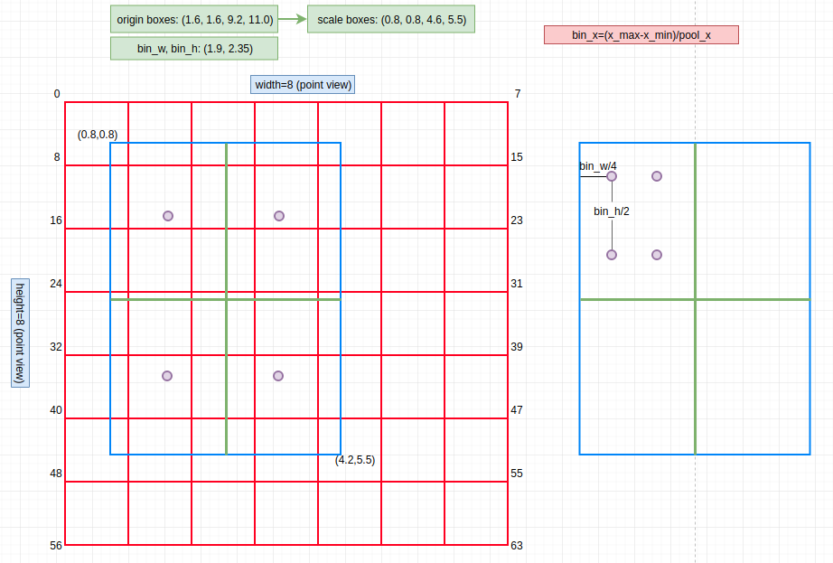

# roi_align_cpp

C++ extension of RoIAlign in PyTorch，this code is converted from [caffe2](https://github.com/pytorch/pytorch/tree/master/caffe2/operators) operation. 


**Run Python**

```shell
python3 roi_align.py
```
**Run C++**

```shell
cd build
cmake ..
make
./roi_align
```

## RoI Align



Note: left `sample=1`, `right sample=2`


There are several good resource to explain these two operations:

- [Region of interest pooling explained](https://blog.deepsense.ai/region-of-interest-pooling-explained/)
- [ROI Align --- chinese](http://blog.leanote.com/post/afanti.deng@gmail.com/b5f4f526490b)
- [ROI Align --- youtube](https://www.youtube.com/watch?v=XGi-Mz3do2s)

### Reference

1. [caffe2 operator](https://github.com/pytorch/pytorch/tree/a2a28c0ef1d9a433972fe72fa5b0b9b850ccfcaf/caffe2/operators)：most of the code is coming from here.
2. [extension-cpp: tutorial](https://github.com/pytorch/extension-cpp)
3. [detectorch](https://github.com/ignacio-rocco/detectorch)
